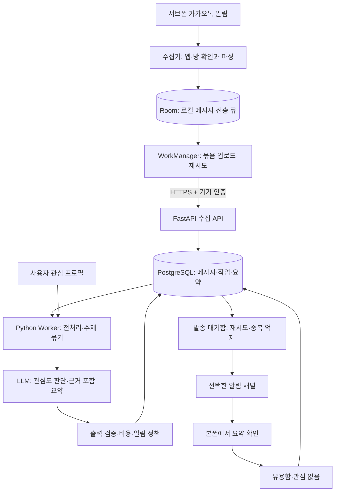

# 카톡 요약 서비스 — 아키텍처 검토안

작성일: 2026-09-16 · 갱신: 2026-09-18 · 상태: Android 0.3.1 / 서버 0.6.1 WSL 실운영 통합

최신 전달 단계는 **방별 원문 수집 진도 → 새 근거만 남긴 요점 → 원문 ID/내용 해시·요약 지문 중복 제거 → 중요도 선택 → 수집 시각순 표시 → Telegram 수락/불명확과 구간 완료를 함께 커밋**한다. `delivery_progress`와 원문 없는 `delivery_source_receipts`는 schema 5에 추가한다. 완료한 구간의 잔여 후보를 새 업데이트로 보내지 않는다. 새/옛 근거가 섞인 요점은 재작성 없이 제외한다. 인용은 새 근거에서만 가져오고 Telegram은 literal 텍스트와 명시 UTF-16 bold entities로 제목/핵심을 강조한다. 오늘 테스트는 10분/3개/144회, 9/19 자정 정상 23:00/1회/5개 복귀다. D-016과 WSL_RUNTIME.md가 아래 과거 전달 제안보다 우선한다.

현재 흐름은 Redmi 알림 → Room/WorkManager → USB ADB reverse → WSL `127.0.0.1:8443` HTTPS → PostgreSQL 16 → OpenAI Responses → 근거 검증·비용 정산 → Telegram 발송 큐다. 외부 공개 서버는 없다. 관리 API는 WSL loopback 8000, 폰 HTTPS는 loopback 8443이다. 데이터베이스는 Unix socket peer 인증이며 전용 서비스 계정은 superuser가 아니다. OpenAI/Telegram 비밀은 필요한 Worker에만 읽힌다. 정기 발송은 23:00 Asia/Seoul, 하루 1회이고 urgent 기본 비활성이다. 이전 ntfy 어댑터는 유지되며 현재 선택은 Telegram이다. 자세한 운영·잔여 조건은 [WSL_RUNTIME.md](WSL_RUNTIME.md)를 따른다.

## M3 구현 상태

M2 커밋 `672092c`에서 관심 프로필과 주제·근거 요약을 추가했다. 영속 작업의 대상 ID·프로필/프롬프트 버전, 소유권 fencing, 방별 중복 억제, 일일 사용량 예약·정산, 실패/보류 상태, 원문 만료 표시와 표본 평가를 구현한다. 요약 저장과 작업 완료는 같은 트랜잭션이다. 외부 API 호출이 없는 추출형 기준선을 제공하고 실제 LLM 어댑터는 자격 증명·공급자 선택 후 연결한다. M3 `0a750c0`에 M4 기기별 정기 발송 큐·ntfy 어댑터·피드백 페이지를 추가했다. 모듈과 실행 계약은 [M3_ANALYSIS.md](M3_ANALYSIS.md), [M4_DELIVERY.md](M4_DELIVERY.md)를 따른다.

Android 구현은 알림 수집기·Room 저장·구조 진단·JSONL 내보내기와 M2 WorkManager 업로드다. 2026-09-17 v0.2.0에서 conversationTitle 누락 대응과 보수적 다단계 parser를 구현했고 기존 실제 방 알림 해석을 확인했다. v0.3.0은 DB 1→2→3 migration과 FastAPI/PostgreSQL 합성 HTTPS 연결을 검증했다. M1의 남은 작업은 **대상 방 선택 후 신규 저장·중복 억제·연속 알림/재부팅 시 room identity·야간 지속성 검증**이다. 사용자는 M1 실측 대기 중 M2/M3/M4 선행 개발을 요청했다. 서버 0.5.0은 위 분석/발송 상태를 따른다. 외부 LLM 어댑터와 운영 채널·실제 본폰 수신은 대기다. [M2 실행과 계약](M2_SYNC.md), [README](../README.md), [단말 검증](DEVICE_TEST.md), [최신 관찰](DEBUG_NOTES.md)을 따른다.

## 1. 설계 방향

**알림에 노출된 메시지는 도착 시 저장하고, 분석과 본폰 전달은 묶어서 수행한다.** 첫 버전은 단일 사용자·단일 방의 정기 요약 서비스다. 사용자 확인에 따라 수집 단말은 **Xiaomi Redmi Note 14 5G / HyperOS 2.0.5 / Android 15**로 확정됐다. Android 알림 기반 수집을 우선 검증할 수 있는 환경이며, 실제 수집률과 지속 동작은 아직 검증되지 않았다.

공식 Android API는 게시·제거된 알림을 관찰하는 기능을 제공한다. 이것만으로 카카오톡의 모든 메시지가 알림에 포함된다는 사실은 입증되지 않는다. 실제 필드와 누락 여부는 M1에서 확인한다. [Android NotificationListenerService](https://developer.android.com/reference/android/service/notification/NotificationListenerService)

## 2. 전체 흐름

M1은 수집과 로컬 DB, M2는 동기화와 서버 저장, M3는 관심·근거 요약, M4는 알림 채널을 담당한다. M4까지 서버 처리 코드를 구현했고 추출형 기준선·모의 ntfy로 합성 검증한다. 실제 운영 서버는 배포하지 않았다. 위 그림의 외부 LLM과 실제 채널 수신은 후속 연결 목표다.

## 3. 구성요소와 책임

| 구성요소 | 제안 기술 | 책임과 경계 |
|---|---|---|
| 수집 앱 | Kotlin, NotificationListenerService | 허용된 방만 파싱, 빠르게 로컬 저장; AI 실행 제외 |
| 로컬 저장·업로드 | Room, WorkManager | 오프라인 큐, 안정된 이벤트 ID, 서버 확인 기반 전송 완료 |
| 수집 API | FastAPI | 기기 인증, 크기·스키마 검사, 멱등 저장, 항목별 결과 반환 |
| 서버 DB | PostgreSQL | 메시지, 작업 상태, 프로필, 요약, 발송 대기함 |
| 분석 Worker | Python | 처리 대상 선택, 주제 묶기, 모델 호출, 출력 검증 |
| LLM 모듈 | 공급자·모델 미정 | 구조화된 관심도·요약 반환, 사용량 측정·상한 적용 |
| 알림 모듈 | 채널 하나 선택 | 요약 전달, 발송 재시도, 조용한 시간·빈도 제한 |

첫 서버는 API·Worker·DB를 한 호스트에서 운영하는 구성을 제안한다. Docker Compose 파일을 제공했다. 이 Windows에는 Docker가 없어 native PostgreSQL 17로 검증했으며 Compose 실행은 아직 검증하지 않았다. 작업 큐는 PostgreSQL의 작업 상태·잠금으로 시작하고 Redis, 벡터 DB, 별도 메시지 브로커는 필요가 입증될 때 검토한다. Supabase는 이전 대화의 대안으로 남기며 동시에 구축하지 않는다.

## 4. 수집과 메시지 식별

1. 사용자가 Android 설정에서 알림 접근을 허용하고, 실제 대상 방에서 본문이 노출되는지 확인한다.
2. 앱 패키지와 방을 확인한 뒤 허용된 범위만 저장한다. 제목만으로 방을 고유하게 식별할 수 있다고 가정하지 않는다.
3. 알림의 메시지 배열·본문·발신자·시각 등 실제 제공 필드를 조사해 파싱한다. 모호한 항목은 불확실 상태로 남긴다.
4. 알림 원본 시각과 수집 시각을 별도로 보존하고, 로컬 저장 완료 후 업로드를 예약한다.

다른 앱·방의 원문은 저장하지 않는다. 방 식별이 불확실하면 본문을 서버로 보내지 않고 상태와 최소 진단 정보만 남긴다. 대상 방의 상세 extras 진단은 짧은 검증 기간에 로컬에서만 사용하며 기본 로그에서는 제외한다.

알림 갱신 시 이전 메시지가 다시 나타날 수 있다. 전송 이벤트의 UUID와 메시지 중복 판정은 별개다. 원본 시각이 신뢰할 만한 경우 기기·방 식별자·발신자·원본 시각·원문을 사용한 후보 지문과 이전 알림 스냅샷의 순서 겹침을 함께 비교한다. 지문 입력은 모호하지 않은 구조로 직렬화한다.

초기 M1 구현은 그룹 `MessagingStyle`만 파싱했으나, 2026-09-16 실기기에서 이 가정이 충분하지 않음이 확인됐다. 다음 parser는 다음 순서를 사용한다: **MessagingStyle → EXTRA_MESSAGES → 표준 extras (`EXTRA_TITLE`, `EXTRA_TEXT`, `EXTRA_SUB_TEXT`, `EXTRA_SUMMARY_TEXT`) fallback**. 각 단계 실패 원인을 구조화해서 진단하며, 실제 필드 매핑은 실기기 결과로 확정한다. fallback은 개인 대화나 다른 방을 대상 오픈채팅으로 오인하지 않도록 보수적으로 구현한다.

방 identity 역시 `sbn.key` 하나에 의존하지 않는다. 실제 chat/channel identifier가 관찰되면 안정성을 먼저 검증하고, 그 다음 shortcutId, 안정적인 tag, 검증된 exact-title fallback을 사용한다. 동일 제목 충돌은 오류/경고 상태로 드러낸다. 메시지 창의 접미부·접두부 겹침 비교, HMAC 기반 dedup snapshot, Room transaction 원칙은 유지한다.

시각이 없거나 같은 시각에 동일 문장이 반복되면 원문 문자열만으로 합치지 않는다. 알림 키·관찰 순서·발생 횟수 등 가용 정보를 사용하고 판정 불확실성을 기록한다. 알림 키 자체를 영구 방 ID로 쓰지 않는다. 정상 반복과 알림 재노출을 구별할 수 있는지는 M1의 필수 검증 항목이다.

## 5. 데이터 구조 초안

| 엔터티 | 주요 필드·관계 |
|---|---|
| Device | device_id, 인증 정보 참조, 마지막 접속, 상태 |
| Room | room_id, device_id, 표시명, 허용 여부, 관찰된 방 식별 매핑 |
| Message | event_id, room_id, sender_alias, text, source_time nullable, observed_at, received_at, URLs, parser_version, parse_quality, fingerprint nullable |
| AnalysisJob | job_id, room_id, 대상 message_id 집합, 상태, 시도 횟수, lease 만료, 프로필·프롬프트 버전 |
| Topic / Summary | topic_id, 관련 message_id, 제목, 요점, 근거 ID, URL, 관련도, 중요도, 불확실성, 모델·사용량 |
| InterestProfile | 관심·제외 주제, 예시, 알림 기준, 시간대, 조용한 시간, 비용 상한, 버전 |
| Delivery | delivery_id, summary_id, 채널, 중복 방지 키, pending/sending/sent/failed, 시도·외부 응답 |
| Feedback | summary_id 또는 topic_id, 유용함·관심 없음, 기록 시각 |

Device/Room/Message와 원문 없는 Receipt는 M2 SQL schema/API 계약으로 구현했다. AnalysisJob 이후 엔터티는 논리 모델이다. 발신자 가명은 기기 또는 프로젝트별 키를 사용하는 HMAC 등으로 만들 수 있으나 익명성 보장으로 표현하지 않는다. 본문에도 개인정보가 남을 수 있다.

## 6. 업로드와 처리 신뢰성

서버는 `(device_id, event_id)`를 고유 키로 사용한다. 단말은 재시도 때 같은 ID를 유지한다. 서버 트랜잭션 커밋 후 항목별 accepted/duplicate/rejected를 반환하고, accepted와 duplicate만 로컬 전송 완료로 처리한다. 형식 오류 항목은 별도 실패 상태로 보존해 무한 재시도를 막는다.

네트워크 단절에는 지수 백오프를 적용한다. 로컬 큐가 한도에 도달하면 사용자에게 상태를 알리고 손실을 기록하며, 조용히 오래된 미전송 메시지를 덮어쓰지 않는다. 보관 만료로 삭제된 미전송 건수도 별도 노출한다.

정기 분석 조건의 초기 제안은 ‘미처리 수집 메시지 500개 이상 또는 미처리 메시지가 있는 상태에서 마지막 처리 후 3시간’이다. 필터 전 서버 수집 건수를 사용하며 방 전체 메시지 수로 부르지 않는다. 주기·개수 조건이 동시에 충족돼도 방별 작업 잠금과 동일한 대상 집합으로 중복 처리를 방지한다. 늦게 업로드된 과거 메시지는 미처리 ID로 다음 작업에 포함한다.

M3 Worker 중단 시 lease 만료 후 재개한다. M3의 요약 저장과 작업 완료는 같은 트랜잭션이며 부분 저장 오류는 전체 롤백한다. M4는 최신 관심 후보로 정기 발송 대기를 생성하며 기기별 잠금·내용 지문·발송 소유권을 저장한다. 공급자 호출은 DB 트랜잭션 밖에서 수행한다. M3의 불명확한 비용은 예약에 반영하며 M4의 불명확한 발송은 uncertain으로 보류해 자동 중복 발송을 줄인다.

외부 발송은 DB와 원자적으로 묶을 수 없다. 공급자 응답 직후 중단되면 재시도에서 중복 전달 가능성이 있다. 지원되는 멱등 키와 delivery_id로 억제하고, 전용 앱 도입 시 수신 측에서도 ID를 확인한다. 정확히 한 번 발송을 보장한다고 표현하지 않는다.

## 7. AI 처리와 알림 품질

전처리는 반복 URL을 주제 후보로 묶고 명백한 잡담을 분석 후보에서 제외한다. 원문을 즉시 삭제하지 않으며, ‘아니요’, ‘취소’처럼 앞선 내용을 뒤집는 짧은 메시지는 주변 문맥과 함께 유지한다. URL 정규화 과정에서 의미 있는 쿼리 매개변수를 임의로 제거하지 않는다.

MVP의 주제 묶기는 URL·시간 인접성·텍스트 단서로 시작한다. 관련 메시지와 제한된 주변 문맥을 묶어 분류·요약한다. 임베딩이나 별도의 두 모델 호출은 품질·비용 측정 후 추가할 선택지이며 필수 전제가 아니다.

LLM은 제목, 요점, 관심도, 중요도, 불확실성, 근거 메시지 ID를 구조화해서 반환한다. 서버는 타입과 점수 범위, 근거 ID의 실재 여부, 원문 URL과의 일치 여부를 검사한다. 검증 실패 시 제한된 재시도 후 발송을 보류한다. 대화 속 주장에는 필요 시 ‘방에서 공유된 주장’임을 드러내며, 모델이 외부 사실 검증을 수행했다고 가정하지 않는다.

채팅 본문의 지시는 신뢰하지 않는다. 모델에는 원문을 데이터로 전달하며 실행 도구·비밀 키 접근 권한을 제공하지 않는다. 링크 본문 자동 조회도 MVP 범위 밖이다.

비용은 실제 입력·출력 토큰과 호출 횟수로 측정한다. 일일 상한 초과 시 분석을 보류하고 수집을 계속하되 보관 만료와 큐 한도를 표시한다. 고정 가격이나 월 예상 비용을 아직 제시하지 않는다.

알림은 관심 기준 통과, 이미 보낸 주제인지, 조용한 시간인지, 일일 횟수 상한을 함께 판단한다. M4는 정기 요약만 전달한다. ‘중요도 90점’ 하나로 긴급 발송하지 않는다. 피드백은 저장하고 프로필 조정에 활용하되 자동 학습을 보장하지 않는다.

## 8. 배치와 긴급 알림의 차이

WorkManager의 정기 작업 최소 간격은 15분이며 실행 시점은 제약과 시스템 최적화로 지연될 수 있다. 따라서 정기 업로드를 3시간 서버 배치와 결합하면 새 메시지의 즉시 전달을 보장할 수 없다. [Android 작업 요청 문서](https://developer.android.com/develop/background-work/background-tasks/persistent/getting-started/define-work)

M5에서는 신규 메시지에 따른 단발 업로드 예약·서버의 빠른 후보 판별 경로를 검토하되 OS 제한을 실측한다. 구간별로 원문→관찰, 관찰→업로드, 업로드→분석, 분석→본폰 수신의 p50·p95를 측정한다. 원본 시각이 없으면 해당 구간은 측정 불가로 표시한다.

FCM은 전용 수신 앱이 필요해 MVP 구축 범위를 늘린다. 또한 메시지는 TTL·기기 상태 등의 영향을 받으므로 API 요청 수락을 실제 본폰 수신으로 간주하지 않는다. 요약 원본은 서버에 보관하고 알림 전송과 조회를 분리하는 방향을 제안한다. [FCM 메시지 수명 문서](https://firebase.google.com/docs/cloud-messaging/customize-messages/setting-message-lifespan)

## 9. 데이터 보호와 운영

- 전송은 HTTPS, 수집 API는 기기별 인증·권한 범위·요청 크기 제한을 적용한다. 자격 증명을 회수할 수 있어야 한다.
- 단말 저장소 보호와 서버 디스크·백업 암호화는 실행 환경에서 확인한다. Room 또는 PostgreSQL 채택만으로 암호화가 완료됐다고 간주하지 않는다.
- 검토 기본값은 원문 7일·요약 90일이다. 진단 extras는 검증 중에만 로컬 보관하고 72시간 이내 삭제를 제안한다. 백업 만료도 같은 데이터 정책에 맞춰 정한다.
- M1은 원문·진단 7일을 기본값으로 구현했다. 앱 시작 또는 활성 상태·알림 처리 중 주기적으로 만료 항목을 정리하며, 앱이 실행되지 않는 동안 정시 삭제는 보장하지 않는다. 상세 extras 저장과 원격 백업은 구현하지 않았다. 진단은 최대 최근 5,000개 레코드로 정리하므로 화면의 진단 합계는 전체 기간 누계가 아니다.
- 원문이 만료되면 요약의 메시지 참조는 ‘원문 보관 만료’로 표시한다. 요약 속 원문 인용도 별도 보관 데이터로 취급하고 최소화한다.
- 수집 중지, 대기열 상태, 데이터 삭제 경로를 제공한다. 요약과 외부 알림 채널의 사본은 별도로 삭제 범위를 설명해야 한다.
- 상태 신호는 마지막 listener 연결, 마지막 알림 관찰, 마지막 업로드, 큐 잔량, 파싱 실패, 분석·발송 실패, AI 사용량이다. 메시지가 없다는 사실만으로 장애라고 판단하지 않는다.
- 공용 서비스·배포로 확장하는 경우 데이터 처리 조건과 관련 플랫폼 정책은 그 시점의 별도 검토 항목이다.

## 10. M1 검증 시나리오와 한계

실기기에서 화면 켜짐·꺼짐, 방을 열어 둔 상태·백그라운드, 방 알림 설정, DND, 절전, 네트워크 단절, 재부팅, 폭주 구간을 나눠 관찰한다. 대상 기기·Android·카카오톡 버전을 보고서에 기록한다.

### 대상 기기별 검증 보완

검증 기준 단말은 Redmi Note 14 5G / HyperOS 2.0.5 / Android 15다. 전체 빌드 번호, 지역 ROM, 카카오톡 버전, 충전·네트워크 조건은 검증 시작 시 기록한다. 현재 정보만으로 특정 지역 ROM이나 설정 메뉴 경로를 추정하지 않는다.

HyperOS 공식 안내는 앱 자동 시작에 사용자 설정이 필요할 수 있음을 설명한다. 따라서 수집 앱과 카카오톡의 자동 시작 설정을 각각 기록하고, 실제 listener 재연결과 알림 발생 여부를 비교한다. 해당 안내만으로 이 빌드에서 자동 시작 허용이 반드시 필요하거나 지속 동작을 보장한다고 결론 내리지 않는다. [Xiaomi HyperOS 자동 시작 안내](https://dev.mi.com/xiaomihyperos/documentation/detail?pId=1624)

| 조건 | 확인할 결과 |
|---|---|
| 첫 설치·알림 접근 허용 | listener 연결, 대상 방의 발신자·본문 노출, 권한 해제 시 상태 표시 |
| 기본 설정에서 야간 화면 꺼짐 | 6~8시간 관찰 구간의 수집률·배터리 변화·연결 중단 여부 |
| 앱별 배터리 설정·자동 시작 설정 비교 | 기본값을 먼저 기록하고 필요한 항목만 바꿔 수집·배터리 차이 측정 |
| 카카오톡 대상 방을 열어 둔 상태 | 알림 미발생 구간과 메시지 누락 여부를 별도 집계 |
| 재부팅 후 잠금 해제 전·후 | 수집 재개 시점, listener 연결, 기존 로컬 데이터 유지 |
| 최근 앱 목록에서 제거·OS의 프로세스 종료 | 각각 별도 시나리오로 수집 재개 여부·지연 기록 |
| 사용자가 설정에서 강제 종료 | 재실행 후 복구·중단 구간 표시를 확인하며 자동 재시작을 통과 조건으로 삼지 않음 |

Android 15의 강제 종료 상태는 사용자 동작으로 해제되는 것이 원칙이다. 강제 종료를 OS에 의한 일반 프로세스 회수와 구분하고, 누락된 기간의 메시지가 자동 복구된다고 가정하지 않는다. [Android 15 동작 변경](https://developer.android.com/about/versions/15/behavior-changes-all#stopped-state)

실제 방의 대조 가능한 시간 구간을 확보하고 실제 메시지와 수집 DB를 비교한다. 가능하다면 사용자가 제공한 대화 내보내기 또는 직접 확인한 표본을 사용한다. 내보내기 지원이나 접근 가능 여부를 가정하지 않는다. 동일 문장 반복·알림 갱신 같은 경계 조건은 통제 가능한 테스트 대화로 추가 검증하되 실제 방의 수집률을 대체하지 않는다.

| 위험 | 확인할 내용 | 판단·대응 |
|---|---|---|
| 본문 미노출·폭주 시 누락 | 상태별 대조 수집률 | 기준 미달이면 수집 경로 또는 제품 범위를 재검토 |
| 알림 갱신·시각 불확실 | 재노출과 정상 반복 구별 | 불확실성 기록, 파서 수정 후 재검증 |
| 방 제목 충돌·변경 | 잘못된 방 분류 여부 | 불확실 방 업로드 중지, 사용자 매핑 갱신 |
| OS 백그라운드 제한 | 연결·동기화 중단, 배터리 변화 | 해당 기기 설정과 지연 허용치 검토 |
| 요약 왜곡·관련 내용 누락 | 사용자 표본 라벨과 근거 대조 | 필터·문맥 범위·프롬프트 조정 |
| 분석·발송 장애 | 복구 후 재처리·중복 여부 | 영속 작업 상태, 제한 재시도, 실패 상태 노출 |

구체적인 통과 기준과 후속 순서는 [PROJECT_BRIEF.md의 마일스톤](PROJECT_BRIEF.md#6-마일스톤과-판단-지점)을 따른다. 실기기 관찰은 DEBUG_NOTES.md, 합성 구현 검증은 VALIDATION.md에 분리해 기록한다.
