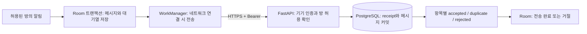

# M2 — 저장과 서버 동기화

2026-09-17 · 버전 0.3.0 · 상태: 구현 및 합성 데이터 검증, 실제 대상 방 검증 대기

사용자는 폰을 조작할 수 없는 동안 다음 마일스톤 개발을 먼저 진행하도록 승인했다. 이 문서의 합성 데이터 결과는 M1 실제 수집 성공이나 수집률을 의미하지 않는다. M3 요약과 M4 본폰 전달은 후속 단계다.

## 구현 흐름



- UUID event_id를 저장 시 한 번 만들고 모든 전송에서 유지한다. `(device_id,event_id)`는 서버 고유 키다. 응답은 서버 트랜잭션 커밋 뒤에 반환한다.
- 서버 receipt의 payload hash가 같으면 duplicate, 같은 ID에 다른 내용이면 event_id_conflict로 거절한다. 원문이 다른 정상 반복은 서로 다른 event_id를 유지한다.
- Android는 설정된 방 room_id만 전송한다. 이전에 선택했던 방의 pending 기록은 자동 전송하지 않는다. 서버에도 같은 기기/방의 허용 등록이 있어야 한다.
- 대기열은 pending/sent/rejected다. 네트워크 실패·429·5xx는 pending을 유지하고 30초부터 지수 백오프를 적용한다. 401/403이나 응답 형식 오류는 동기화를 중지하고 설정 확인을 요청한다.
- 응답의 ID 집합·개수·상태를 모두 검사한 뒤 한 트랜잭션에서 적용한다. 일부 거절은 나머지 성공과 별도로 남는다. 알 수 없는 서버 오류 문자열은 저장하지 않는다.
- 한 요청은 최대 100항목/900KB, 서버는 100항목/1MB로 제한한다. 정상 URL·본문 길이를 넘어선 항목은 서버가 거절하고 로컬 원문은 7일 보존한다.
- 900KB를 넘는 단일 항목은 client_item_too_large로 로컬 거절 표시해 다음 항목의 전송을 막지 않는다. 원문은 같은 보관 기간 동안 남는다.
- WorkManager는 연결 제약과 고유 작업을 사용한다. 설정·새 메시지 때 단발 작업, 복구용 15분 주기 작업을 등록한다. OS 정책 때문에 실행 시각은 지연될 수 있다. [Android 작업 요청](https://developer.android.com/develop/background-work/background-tasks/persistent/getting-started/define-work)
- 처리 중 stop/config 변경을 감지하면 응답을 로컬 완료로 적용하지 않는다. 이미 진행 중인 요청이 서버에 저장될 수 있으며, 다시 연결하면 duplicate로 정리한다.
- pending+rejected 한도는 50,000개다. 넘으면 해당 알림 창의 새 항목 일부를 저장하지 못하고 queue_overflow_entries로 표시한다. 기존 미전송 기록을 덮어쓰지 않는다.
- Android 원문 7일 만료 시 대기열도 함께 삭제하고 expired_unsent를 기록한다. 진단 합계는 최근 보관 범위 내 수치다.
- 서버는 observed_at 기준 원문 7일, 원문 없는 receipt 30일을 보존한다. 7일보다 오래된 이벤트는 받지 않아 만료 데이터를 복원하지 않는다. retention 프로세스가 매시간 정리한다. 서버가 중단된 동안 정시 삭제는 보장하지 않는다.
- 서버 방 삭제는 원문과 receipt를 삭제하고 방을 차단한다. 자동 재전송으로 복원되지 않으며 재허용은 명시적 provision 작업이 필요하다. 로컬 삭제는 서버나 외부 파일의 사본을 삭제하지 않는다.

## 서버 실행

개발·개인 운영 기본값은 단일 FastAPI/PostgreSQL 구성이다. 외부 공개 서버는 아직 배포하지 않았다. Compose 파일은 제공했지만 이 Windows에서는 Docker가 없어 native PostgreSQL로 검증했다.

1. 루트 `.env.example`을 `.env`로 복사하고 무작위 URL-safe DB 비밀번호를 설정한다. `.env`는 Git 제외다.
2. 루트에서 `docker compose up -d --build` 실행. API는 컴퓨터 localhost:8000, DB는 컨테이너 내부에만 노출한다.
3. 외부 연결용 HTTPS 도메인과 TLS reverse proxy를 준비한다. Android 앱은 HTTPS origin만 받고 HTTP·사용자정보·query·추가 path·redirect를 허용하지 않는다. Compose localhost 주소를 폰의 운영 서버 주소로 사용하지 않는다.
4. Android에서 방 선택 후 서버 연결 화면의 room ID를 확인한다. 기기 ID는 UUID, 토큰은 무작위 32자 이상으로 정한다.
5. `docker compose exec api python -m radar_server.manage provision --device DEVICE_UUID --room ROOM_UUID` 실행하고 토큰을 비밀 입력한다. 서버에는 SHA-256 digest만 저장한다.
6. 앱의 **서버 연결 설정**에 HTTPS origin·기기 UUID·동일 토큰을 입력하고 연결한다. 이 시점부터 선택한 방의 저장 원문을 보낸다. 토큰은 Android Keystore AES-GCM으로 암호화해 앱 전용 설정에 저장한다.

Native 개발 환경은 Python 3.12, PostgreSQL 17을 사용했다. `server`에서 가상 환경을 만들고 `pip install -r requirements.txt`, `RADAR_DATABASE_URL` 설정 후 `python -m radar_server.manage migrate`, `uvicorn radar_server.app:create_app --factory --host 127.0.0.1 --port 8000 --no-access-log`로 시작한다. 보관 정리는 별도 `python -m radar_server.retention`으로 실행한다. 실제 설치 버전 전체는 requirements-lock.txt에 기록했다.

기기 전체 인증 폐기: `python -m radar_server.manage revoke --device DEVICE_UUID`. 토큰 교체: 같은 기기에 새 토큰으로 provision. API에 공개 등록 endpoint는 없다.

서버 관리자 방 삭제: `python -m radar_server.manage delete-room --device DEVICE_UUID --room ROOM_UUID`. Compose에서는 `docker compose exec api` 뒤에 같은 Python 명령을 붙인다. 서버 원문/receipt를 삭제하고 방을 차단하며 로컬 파일은 별도로 관리한다.

## API 계약

| 메서드 / 경로 | 인증 | 동작 |
|---|---|---|
| GET /health | 없음 | 프로세스 상태와 버전 (DB 상태 검사는 /v1/status) |
| POST /v1/messages/batch | Bearer | 항목별 커밋 결과 |
| GET /v1/status | Bearer | 인증된 기기의 저장 건수·마지막 수신 |
| DELETE /v1/rooms/{room_id}/data | Bearer | 본인 기기의 해당 방 삭제·차단 |

요청 예시는 실제 방과 무관한 합성 값이다.

```json
{"items":[{"event_id":"11111111-1111-4111-8111-111111111111","room_id":"22222222-2222-4222-8222-222222222222","sender_alias":"unknown","text":"합성 테스트 메시지","source_time":null,"observed_at":1789600000000,"urls":[],"quality":"fallback_no_message_time","parser_version":2}]}
```

observed_at은 실제 테스트 시 현재 epoch milliseconds로 바꾼다. 서버는 원문·방 표시명·닉네임을 로그나 오류 응답에 넣지 않고, DB에 원문과 HMAC 발신자를 저장한다. 방 제목은 서버 전송 필드에서 제외했다.

## 검증 재실행

개발 의존성: `pip install -r requirements-dev.txt`. **별도 PostgreSQL 테스트 DB**에 RADAR_TEST_DATABASE_URL을 설정하고 `server`에서 `pytest -q`. 실제 운영 DB를 테스트 DB로 사용하지 않는다.

단말 합성 연결 검사:

1. 별도 개발 DB로 RADAR_DATABASE_URL을 설정하고 `server`에서 `python tools/dev_https_fixture.py`. localhost:8443의 하루짜리 인증서·합성 기기/방을 만든다. 비밀 test-args.json은 Git 제외된 .state 안에만 저장한다.
2. 앱 및 androidTest APK를 설치하고 `adb reverse tcp:8443 tcp:8443` 실행.
3. .state/test-args.json의 인자를 `adb shell am instrument -w -e class dev.kakaoradar.collector.SyncDeviceTest -e test_server https://localhost:8443 -e test_device ... -e test_room ... -e test_token_base64 ... -e test_ca_base64 ... dev.kakaoradar.collector.test/androidx.test.runner.AndroidJUnitRunner`에 전달한다. 인자 값을 로그/저장소에 복사하지 않는다.
4. 테스트는 별도 단말 DB의 합성 메시지만 전송한다. 임시 테스트 CA는 이 테스트의 transport 객체만 신뢰하며 OS나 실제 앱 설정에 설치하지 않는다. 기기 인증·방 설정을 실제 collector에 쓰지 않는다.
5. 종료 후 `adb reverse --remove tcp:8443`. fixture 서버 Ctrl+C 종료 시 합성 기기/데이터가 삭제된다.

## 완료 기준과 남은 검증

M2 코드·합성 데이터 검증 결과는 VALIDATION.md에 기록한다. 실제 대상 방→장시간 WorkManager 전송, WAN/TLS 운영, 재부팅/화면 꺼짐/대규모 실제 부하·배터리는 별도 검증해야 한다. M1 대상 방 수집률 95%나 M2 운영 완료를 선언하지 않는다. M3는 관심 프로필·공급자·예산 확인 후 이어간다.
