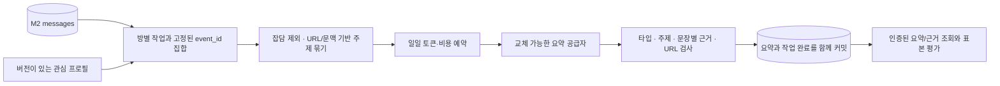

# M3 — 관심 프로필과 근거 요약

2026-09-17 · 기준 M2 커밋 `672092c` · 상태: 코드·합성 검증 완료, 외부 AI·사용자 평가 대기

사용자는 M1 실제 수집 검증을 기다리는 동안 M3 설계와 구현을 요청했다. M3 코드 구현, 외부 AI 연결, 사용자 품질 평가를 각각 기록한다. 실제 방 원문이나 비밀 키를 fixture에 넣지 않는다.

## 책임과 흐름



- Android와 M2 수집 API의 전송 계약은 유지한다. 분석은 서버에서 실행한다.
- `analysis_models.py`: 프로필, 공급자 입출력, 문장별 근거와 사용량 계약.
- `topics.py`: 보수적 잡담 제거, URL 정규화, 시간/단어 겹침과 짧은 정정 문맥 묶기.
- `providers.py`: 공급자 인터페이스와 외부 호출이 없는 추출형 기준선. 기준선은 의미 이해 LLM을 대체하지 않는다.
- `analysis_store.py`: PostgreSQL 작업 소유권, 재시도, 예산 예약, 요약 저장과 조회.
- `worker.py`: 작업 획득 → 전처리 → 예약 → 공급자 → 검증 → 커밋. 공급자 호출은 DB 트랜잭션 밖이다.
- `evaluation.py`: 사용자 라벨에 대한 관심 재현율/후보 정밀도와 근거 검토 집계. 내용이나 라벨을 자동으로 사용자 의견이라고 간주하지 않는다.

## 프로필과 기본값

기기별 최신 프로필에 관심/제외 주제, 좋은/나쁜 알림 예시, 후보 점수 기준, 시간대, 일일 토큰·비용 상한, 배치 크기/대기 시간과 입력 한도를 저장한다. 모든 변경은 새 버전이다. `expected_version`이 다르면 409를 반환한다.

기본은 `enabled=false`, 일일 예산 0이다. 사용자 관심사나 유료 모델 가격을 추측해 운영 설정으로 넣지 않는다. 활성화하려면 관심 주제와 양수 토큰 상한이 필요하다. 비용 단위는 정수 micro-USD이며 1 USD = 1,000,000 micro-USD다. 외부 공급자는 양수 비용 예약이 필요하지만 비용이 없는 기준선은 비용 상한 0으로도 실행할 수 있다.

프로필 변경은 미완료 작업을 취소하고 대상 ID를 다시 처리 가능하게 한다. 완료한 메시지는 새 프로필로 자동 재분석하지 않는다. 진행 중 호출의 비용 예약은 취소/방 삭제로 환불하지 않는다.

## 작업, 재시도와 늦은 업로드

방과 예산의 행 잠금은 [PostgreSQL의 공식 잠금 명세](https://www.postgresql.org/docs/17/explicit-locking.html)를 따른다. lease 소유권 검사는 DB 실제 시계로 수행하며 트랜잭션 시작 시각을 현재 시각으로 간주하지 않는다.

- 필터 전 미처리 서버 메시지 500건 또는 대기 3시간을 초기 조건으로 사용한다. 개수와 시간 조건은 같은 방 잠금 아래 평가한다.
- 정렬은 서버 수신 시각, 관찰 시각과 event_id다. source_time 기준 커서로 처리 여부를 판단하지 않으므로 늦은 과거 메시지도 포함한다.
- 큰 배치는 출력 한도에 맞춘 작은 작업으로 나누고 trigger_cutoff 이전 잔여 메시지는 추가 3시간 대기 없이 처리한다. 최근 완료 원문 최대 3개를 문맥으로 사용하며, 신규 대상이 없는 이전 주제를 다시 요약하지 않는다.
- 고정된 대상 ID 집합과 프로필/프롬프트 버전을 작업에 저장한다. 작업 항목의 `(device_id,event_id)` 고유 제약으로 중복 작업을 막는다.
- 작업 lease와 매 획득마다 바뀌는 owner_token을 함께 검사한다. 만료 후 이전 Worker의 결과를 저장하지 않는다.
- 최대 3번의 공급자 호출, 지수 백오프, 최종 failed 상태를 사용한다. 예산 부족은 paused 상태로 보류하며 호출 횟수를 소모하지 않는다.
- 최종 실패는 ID와 정해진 오류 코드로 관찰한다. 오류에 원문/공급자 응답을 남기지 않는다.
- 근거 원문이 만료된 미완료 작업은 source_expired로 실패한다. 새로운 근거를 만들어 완료하지 않는다.

## 근거와 출력 검증

모든 주제에 제목, 요점, 관련도/중요도, 불확실성, URL을 저장한다. 요점마다 해당 주제의 event_id 근거가 필요하다. 존재하지 않는 ID, 다른 주제의 ID, 원문에서 제공하지 않은 URL, 중복/누락 주제, 잘못된 타입/점수는 거절한다. 불확실 parser 결과는 확실한 요약으로 표시하지 않는다.

입출력 타입은 [Pydantic strict mode](https://github.com/pydantic/pydantic/blob/main/docs/concepts/strict_mode.md)로 검사한다. 숫자 문자열과 bool을 관련도 정수로 변환하지 않는다.

이 검사는 형식과 참조 무결성을 검사한다. 주장 의미가 근거에 의해 뒷받침되는지는 사용자 표본 평가가 필요하다. 추출형 기준선은 합성 메시지의 짧은 원문 구절과 정정 문맥을 그대로 사용하며, 모든 결과는 방에서 공유된 주장임을 표시한다. 링크를 자동으로 열거나 외부 사실을 검증하지 않는다.

채팅 내용은 신뢰하지 않는 데이터다. 공급자 입력에는 도구나 자격 증명을 제공하지 않는다. 외부 AI를 연결하려면 자격 증명 사용 결정을 먼저 확인하고, 공급자의 출력/타임아웃/사용량 계약을 지키는 어댑터를 추가한다.

## 예산과 호출 중단

프로필 시간대의 날짜별로 예약과 사용량을 계산한다. 기기 잠금 아래 최대 토큰/비용을 먼저 예약하므로 여러 방/Worker의 동시 호출도 같은 일일 상한을 공유한다. 성공 시 실제 보고 사용량으로 정산한다. 기준선의 토큰은 **합성 추정값**, 비용은 0이며 외부 AI 사용량으로 표현하지 않는다.

호출 실패/응답 유실/Worker 중단처럼 과금 여부를 모르면 예약을 유지한다. lease 만료가 예산 환불 사유가 아니다. 다음 호출은 남은 예산과 재시도 상한을 다시 확인한다. 공급자가 예약을 넘는 사용량을 보고하면 그대로 집계하고 결과 저장을 보류한다. 외부 공급자의 최대 사용량 계약 없이 절대 비용 상한을 보장하지 않는다.

## API와 실행

모든 M3 API는 기존 Bearer 기기 인증과 동일한 소유권 범위를 사용한다.

| 메서드 / 경로 | 동작 |
|---|---|
| GET /v1/profile | 최신 프로필과 버전; 미설정은 비활성 기본값 |
| PUT /v1/profile | expected_version과 profile로 새 버전 저장 |
| GET /v1/analysis/status | 작업 상태별 개수와 오늘의 예약/사용량 |
| GET /v1/analysis/jobs | 실패/보류를 포함한 작업 목록 |
| GET /v1/rooms/{room_id}/summaries | 페이지가 있는 요약 목록; 후보만 조회 가능 |
| GET /v1/summaries/{summary_id}/evidence | 문장별 근거 원문, 또는 보관 만료 표시 |

Worker는 기본 비활성이다. 외부 API를 호출하지 않는 기준선만 명시적으로 실행할 수 있다.

공급자 인터페이스는 external 여부, 최대 토큰/비용 예약, 구조화된 출력과 사용량을 요구한다. external=true이면서 비용 예약이 0인 공급자는 호출 전에 차단한다.

```bash
cd server
# RADAR_DATABASE_URL은 별도 개발 PostgreSQL DB로 설정한다.
python -m radar_server.manage migrate
python -m radar_server.worker --provider extractive --once --force
# 계속 실행: --once와 --force를 빼고 동일 명령을 사용한다.
```

`--force`는 메시지 개수/대기 시간 조건만 생략한다. 인증, 프로필 활성화, 예산, lease 검사와 실패 한도는 유지한다. Compose Worker는 별도 analysis 프로필로 실행하며 기본 up에는 포함하지 않는다.

## 보관과 삭제

M2 원문 7일/receipt 30일은 유지한다. 요약과 작업은 90일 보관한다. 원문 만료 뒤 요약은 남고 근거 조회에서 raw_expired를 반환한다. 요약의 추출 문장도 보관 데이터다. 방 삭제는 해당 방의 원문/receipt/작업/요약을 삭제하고 업로드를 차단한다. 원문 없는 사용량 기록은 90일 유지해 진행 중 호출의 예산을 보존한다.

## 평가와 완료 판단

라벨 파일은 관심 여부, 문장 근거 검토 여부와 후보 결과를 분리한다. 도구는 최소 50개 라벨, 관심 재현율 90%, 후보 정밀도 80%, 근거 없는 핵심 주장 0개와 모든 후보의 근거 검토를 판단한다. 분모가 없는 지표는 null이며 통과시키지 않는다. 합성 결과를 개인화 품질 통과로 기록하지 않는다.

```bash
python -m radar_server.evaluation --input /path/to/labels.json
```

입력 형식(아래 한 항목은 합성 예시이며 실제 평가에는 50개 이상 필요):

```json
{"labels":[{"topic_id":"synthetic-topic-1","interested":true,"claims_supported":true}],"predictions":[{"topic_id":"synthetic-topic-1","is_candidate":true}]}
```

근거를 검토하기 전 claims_supported는 null로 둔다. 입력 문법 오류는 종료 코드 1, 기준 미달/검토 대기는 2, 모든 기준 통과는 0이다.

M3 선행 구현의 완료는 프로필→작업→검증된 요약→근거 조회, 예산 차단/경쟁/복구/만료/삭제의 합성 검증이다. **외부 LLM 연결과 사용자 50개 주제 평가는 별도 대기 항목이다. M4 본폰 발송은 이 작업에 포함하지 않는다.**

검증은 서버 66개(기존 M2 11개 포함), 수집 비교 도구 5개가 통과했다. 재현 가능한 합성 실행 보고서는 별도 테스트 클러스터에서 만들어진다.

```bash
cd server
pip install -r requirements-dev.txt
python tools/run_local_tests.py --postgres-bin /path/to/pgsql/bin
```

이 명령은 전용 localhost PostgreSQL을 시작하고 테스트와 합성 demo를 실행한 뒤 중지한다. M4 추가 후 전체 검사 보고서는 `.state/m4-tests.xml`이며 M3 demo는 `.state/m3-demo.json`, `.state/m3-demo.md`에 남긴다. 기존 서버/단말 설정은 바꾸지 않는다. 최신 실행 도구의 전용 DB와 M4 보고서는 [M4_DELIVERY.md](M4_DELIVERY.md)를 따른다.
