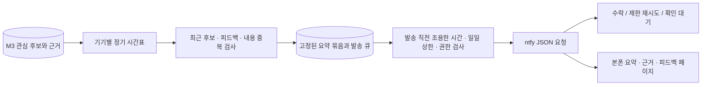

# M4 — 본폰 정기 요약과 피드백

2026-09-17 · 기준 M3 `0a750c0` · 서버 0.5.0 · 상태: 선행 구현, 실제 본폰 연결·사용자 평가 대기

사용자의 M4 구현 요청에 따라 정기 전달, 조용한 시간, 중복 억제, 피드백과 장애 복구를 추가한다. 채널 선택 응답이 없는 개발 단계에서는 ntfy 어댑터를 기본 구현으로 사용한다. 채널·본폰 OS·실제 허용 시간은 사용자 선택으로 확정하지 않았다. 합성 검증에는 모의 ntfy 응답만 사용하며 실제 메시지를 외부로 보내지 않는다.

## 흐름과 모듈



수집 앱과 M2 전송 계약, M3 분석·예산 계약을 유지한다. 추가 파일:

- `delivery_models.py`: 엄격한 설정, 시간대/서머타임 처리, 내용 지문과 UTF-8 알림 길이.
- `delivery_store.py`: PostgreSQL 발송 큐, 기기 잠금, 발송 소유권, 시도 상한, 피드백·삭제·조회.
- `delivery_channels.py`: HTTPS ntfy JSON 어댑터와 요약 묶음에 한정된 HMAC 링크.
- `delivery_worker.py`: 명시적으로 활성화하는 발송 Worker. 네트워크 호출은 DB 트랜잭션 밖에서 실행한다.
- `static/digest.*`: 본폰에서 요약·관련 링크·근거를 읽고 유용함/관심 없음 피드백을 남기는 페이지.

## 기본값과 일정

발송은 기본 `enabled=false`, 시간표는 빈 목록, 일일 상한은 0이다. 일반 Compose 실행에는 delivery Worker가 포함되지 않는다. 관심 프로필도 활성 상태여야 한다. 사용자가 정한 시간표와 양수 일일 상한을 설정한 후 Worker를 명시적으로 실행한다.

시간표는 지정한 IANA 시간대의 `HH:MM` 목록이다. 설정 시점 이후 첫 시간부터 적용하며 설정 저장만으로 즉시 발송하지 않는다. Worker 중단 중 여러 시간을 놓쳤으면 복구 후 한 묶음만 준비한다. 빈 묶음은 발송하지 않는다. 조용한 시간은 시작을 포함하고 끝은 포함하지 않으며 자정을 넘는 구간도 지원한다. 해당 시간에 준비한 묶음은 조용한 시간이 끝날 때까지 기다린다. 재시도에도 동일 검사를 적용한다.

서머타임으로 존재하지 않는 시각은 다음 유효 분으로 이동한다. 두 번 등장하는 시각은 첫 시각에만 실행한다. 서버/Worker의 실행 지연은 허용 시간 이후 실제 발송 시점을 늦출 수 있다. 본폰 알림 표시 시각은 채널과 OS 상태의 영향을 받는다.

아래는 **검토용 설정 예시**이며 실제 사용자 시간표가 아니다:

```json
{
  "expected_version": 0,
  "policy": {
    "enabled": true,
    "channel": "ntfy",
    "timezone": "Asia/Seoul",
    "daily_times": ["09:00", "18:00"],
    "quiet_start": "23:00",
    "quiet_end": "08:00",
    "daily_notification_limit": 2,
    "max_topics_per_digest": 5,
    "max_summary_age_hours": 72,
    "dedup_hours": 24,
    "max_attempts": 3
  }
}
```

설정은 `expected_version`으로 동시 변경을 막는다. 설정 변경은 대기/재시도 묶음을 취소하고 내용을 지운다. 새로운 설정에서 아직 처리하지 않은 최신 프로필의 후보를 다시 준비할 수 있다. 호출이 이미 시작됐으면 외부 수락을 취소할 수 없으며, 그 결과와 시도 기록을 보존한다. 프로필 변경·비활성화는 발송 직전 검사를 통해 이전 프로필의 대기 묶음을 취소한다.

## 후보와 중복

완료된 M3 작업의 `is_candidate=true` 요약을 최신 관심 프로필 버전에서만 선택한다. 원문이 7일 후 만료돼도 보관 중인 요약을 읽을 수 있고 근거는 `raw_expired`로 표시한다. 기본 후보 최대 나이는 72시간이다. 오래된 후보·허용되지 않은 방·관심 없음 피드백은 제외한다.

한 요약 ID는 한 묶음에만 할당한다. 별도 ID로 다시 분석된 동일 제목·요점·URL·불확실성도 같은 방에서 최근 24시간 동안 억제한다. 근거 ID 변경은 새 내용으로 간주하지 않는다. 정정/취소, URL의 의미 있는 쿼리, 불확실성 변경은 다른 내용으로 남긴다. 이는 내용 지문 비교이며 의미가 비슷한 표현 전체를 이해하는 중복 분류기가 아니다. 한 번에 오래된 후보 1,000개까지 살피고 최대 10개 주제를 묶는다. 알림 본문은 3,800 UTF-8 바이트 이하의 짧은 첫 요점이며 전체 요점은 페이지에서 읽는다.

## 시도 상한과 장애 복구

기기 행 잠금 아래에서 한 활성 발송 묶음과 하루 시도 예약을 만든다. 여러 Worker나 여러 방이 같은 기기의 상한을 공유한다. **일일 상한은 네트워크 호출을 시작한 시도 수**다. 수락·거절·응답 유실·Worker 중단도 하루 시도에 포함한다. 방 삭제/설정 변경으로 시도 기록을 환불하지 않는다. 현재 설정 시간대의 실제 시도 시각으로 집계하므로 시간대 변경이나 감사용 날짜 값 변경이 상한을 초기화하지 않는다.

| 상태/상황 | 동작 |
|---|---|
| `pending` | 시간표에 맞춰 준비, 조용한 시간/상한/권한을 다시 검사 |
| `sending` | owner_token과 90초 lease를 가진 호출 한 개 |
| `accepted` | ntfy가 정상 메시지 ID를 반환; 실제 본폰 수신은 별도 확인 |
| 연결 시작 실패 / HTTP 429 | `retry_wait`, 지수 백오프, Retry-After 최대 24시간, 최대 3회 |
| 인증 실패 / 다른 HTTP 4xx | `failed`, 원문 없는 오류 코드; 자동 반복 없음 |
| 응답 유실 / 잘못된 성공 응답 / 5xx / Worker 중단 | `uncertain`, 시도 예약 유지, 자동 재발송 없음 |
| 설정/프로필 변경, 근거 요약 만료, 방 삭제 | `cancelled`, 발송 전 보류 또는 저장 사본 제거 |

`uncertain`은 본폰/채널에서 확인 후 `mark_accepted`로 처리한다. 재발송을 원하면 `retry`와 `acknowledge_duplicate_risk=true`가 필요하다. 이 작업은 설정·권한·조용한 시간·일일 상한·시도 한도를 유지한다. 기기별 다른 대기 묶음이 있으면 409이며 먼저 그 묶음을 처리해야 한다. 이미 최대 시도를 사용한 실패는 반복하지 않는다.

외부 발송과 DB 커밋을 한 트랜잭션으로 묶지 않는다. ntfy의 sequence ID 업데이트를 정확히 한 번 전달 보장으로 간주하지 않는다. 발송 결과가 불명확한 경우 사용자의 명시적 재시도는 같은 알림을 다시 표시할 수 있다. ntfy 수락은 본폰 표시나 사용자의 읽음으로 기록하지 않는다.

## 채널 연결과 본폰 페이지

[ntfy 공식 JSON 발송 문서](https://docs.ntfy.sh/publish/#publish-as-json)에 따라 HTTPS 서버 루트에 JSON을 POST한다. 정기 알림은 priority 3이며 긴급 알림은 구현하지 않는다. 실제 연결 값은 서버의 `.env`에만 넣는다:

```dotenv
RADAR_DELIVERY_PROVIDER=ntfy
RADAR_NTFY_URL=https://your-ntfy-server.example.com
RADAR_NTFY_TOPIC=your-private-topic
RADAR_NTFY_TOKEN=your-access-token
RADAR_PUBLIC_URL=https://your-radar-server.example.com
RADAR_DIGEST_LINK_SECRET=your-random-secret-with-at-least-32-characters
```

ntfy 토픽에는 구독/발행 접근 제어가 필요하다. 토큰만 넣는 것으로 토픽의 읽기 보호까지 확인한 것은 아니다. [공식 접근 제어 안내](https://docs.ntfy.sh/config/#access-control)를 따라 보호된 토픽을 사용하고 본폰 ntfy 앱에서 해당 서버/토픽에 로그인·구독한다. 본폰 OS에 따른 수신·절전 특성은 실제 단말에서 확인한다.

`RADAR_PUBLIC_URL`은 본폰에서 접근 가능한 Radar HTTPS 루트다. API와 delivery Worker에 동일한 링크 secret을 넣는다. 두 값은 함께 설정하며 생략하면 ntfy 텍스트 발송만 제공한다. 링크에는 기기 토큰을 넣지 않는다. URL fragment의 키는 해당 묶음의 요약/근거 읽기와 포함된 주제의 피드백만 허용하며 다른 API에 쓸 수 없다. 링크는 묶음 생성 후 7일 동안 유효하고 방 삭제·기기 인증 회수·링크 secret 교체로 접근이 중단된다. 링크를 가진 사람은 해당 묶음의 근거 원문을 볼 수 있다.

페이지는 같은 서버의 자원만 읽고 채팅 내용을 `textContent`로 표시한다. 관련 링크는 사용자가 선택해야 열린다. fragment 키는 일반 HTTP 요청 URL에 전송되지 않는다. 요약 응답은 `no-store`, 페이지는 `no-referrer`와 CSP를 적용한다.

```bash
cd server
python -m radar_server.manage migrate
# 환경 변수를 실제 서버 설정으로 준비한 뒤, 명시적으로 실행한다.
python -m radar_server.delivery_worker --provider ntfy --once
# 계속 실행하려면 --once를 생략한다.
```

Compose는 `.env`를 준비하고 `docker compose --profile delivery up --build`로 실행한다. API는 localhost:8000에 바인딩된다. 본폰 접근용 운영 HTTPS/reverse proxy는 이 코드 검증에서 배포하지 않았다. `GET /v1/delivery/status`의 configured는 설정 형식 검사이며 실제 접근 제어, 네트워크 연결 또는 Worker 생존 확인이 아니다.

## API

일반 API는 기존 Bearer 기기 인증/소유권 범위를 따른다. 링크 API만 `Authorization: Digest <scoped-key>`를 사용한다.

| 메서드 / 경로 | 동작 |
|---|---|
| GET /v1/delivery/policy | 버전과 설정·다음 정기 시각 |
| PUT /v1/delivery/policy | expected_version으로 설정 변경 |
| GET /v1/delivery/preview | 후보 미리보기; 큐/발송 상태를 변경하지 않음 |
| GET /v1/delivery/status | 상태별 개수, 오늘 시도 수/상한, 설정 준비 여부 |
| GET /v1/delivery/history | 페이지가 있는 발송·오류 기록 |
| POST /v1/delivery/{delivery_id}/resolve | 확인 대기 수락 표시 또는 중복 가능성을 승인한 재시도 |
| PUT /v1/summaries/{summary_id}/feedback | useful / not_interested 저장·변경 |
| GET /v1/feedback | 피드백 목록 |
| GET /v1/digests/{delivery_id} | 해당 링크에 한정된 요약·근거 조회 |
| PUT /v1/digests/{delivery_id}/summaries/{summary_id}/feedback | 포함된 요약의 피드백 |
| GET /digest/{delivery_id}#key=... | 본폰 페이지 |

피드백은 사용자가 바꿀 수 있으며 동일 요약의 한 기록을 갱신한다. 관심 없음은 해당 요약의 대기 발송을 막고 프로필 수동 조정의 자료로 사용한다. 관심 주제 전체를 자동 삭제하거나 자동 학습하지 않는다.

## 보관과 삭제

M2 원문 7일·receipt 30일, M3 요약/작업 90일을 유지한다. M4 발송 사본·시도 기록도 생성 시점부터 90일 보관한다. 피드백은 연결된 요약의 만료/삭제와 함께 제거한다. 방 삭제는 해당 방을 포함한 전체 묶음 사본을 지우고 링크를 회수한다. 요약이 먼저 만료돼 참조가 없어져도 사본의 방 ID로 삭제할 수 있다. 원문 없는 시도 기록은 유지해 그날 상한을 보존한다.

외부 ntfy/본폰의 사본은 서버 방 삭제로 자동 삭제하지 않는다. 이미 시작된 네트워크 호출도 방 삭제로 취소를 보장할 수 없다. 여러 방 묶음이 지워지면 다른 방의 아직 남은 후보가 후속 묶음에 다시 포함될 수 있다. MVP는 명시적으로 선택한 방 한 개다.

## 합성 검증과 실제 완료 기준

```bash
cd server
pip install -r requirements-dev.txt
python tools/run_local_tests.py --postgres-bin /path/to/pgsql/bin
# 페이지를 실제 브라우저로 확인할 때:
python tools/run_local_tests.py --postgres-bin /path/to/pgsql/bin --serve
```

전용 localhost:55330/radar_m4_test에서 M2/M3/M4 검사를 실행한다. M3 demo와 M4 demo는 외부 API 호출 없이 합성 데이터를 사용한다. 보고서는 `.state/m4-tests.xml`, `.state/m4-demo.json`, `.state/m4-demo.md`다. `--serve`는 합성 링크와 localhost:8004 페이지를 제공하며 `.state/stop-m4-ui` 파일을 만들면 페이지/테스트 클러스터를 중지하고 임시 데이터를 지운다. 다른 M2/M3 DB나 collector 설정을 바꾸지 않는다.

이번 개발 검증은 코드 경로와 합성 장애 복구다. **운영 채널/본폰 수신, 실제 방→본폰 전 구간, 알림량·유용성 사용자 평가가 M4 운영 완료 조건으로 남는다.** 외부 LLM·사용자 50개 주제 평가는 M3에서 별도로 진행한다.
